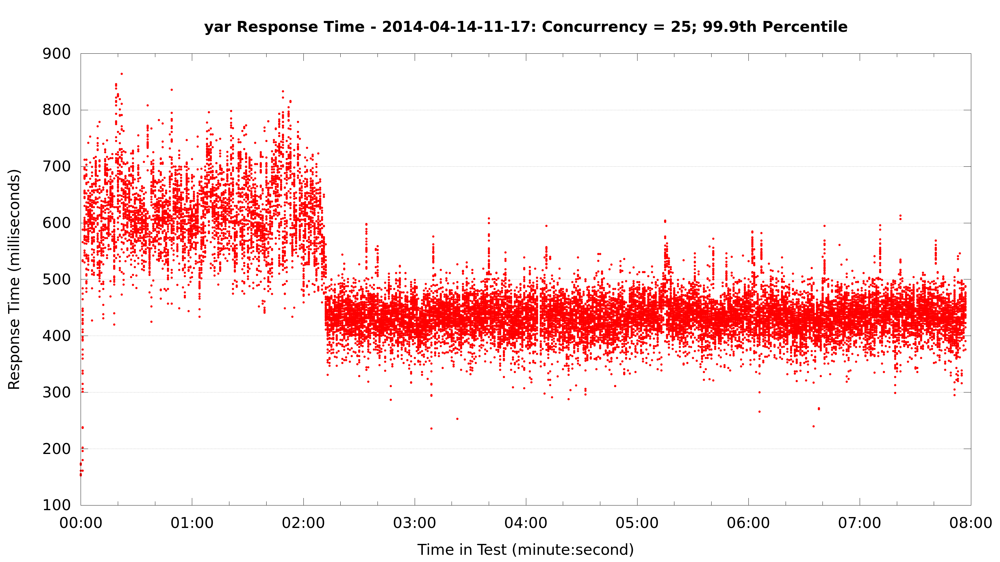

The simplest way to run a load test against a functionally
complete yar deployment is to 
spin up a [VirtualBox](https://www.virtualbox.org/) VM running
[Ubuntu 12.04 + version 3.8 of the Linux kernel](http://releases.ubuntu.com/12.04/)
and containing all of the necessary
[Docker](https://www.docker.io/) images for each of the various
yar services and supporting infrastructure.
See [these](..) instrutions for a complete description of how to spin up this VM.
The remainder of these instructions assume such a VM is up and running.

Massively Quick Intro to Running A Load Test
--------------------------------------------

~~~~~
>cd; cd yar; source bin/cfg4dev; cd tests
(env)>./provision.sh
<<<cut lots of messages>>>
Cleaning up...
 ---> 296a0d185246
Successfully built 296a0d185246
Removing intermediate container 5a44c1ec3b91
<<<cut lots of messages>>>
Removing intermediate container d984d433d10b
(env)>vagrant ssh
Welcome to Ubuntu 12.04 LTS (GNU/Linux 3.8.0-38-generic x86_64)

 * Documentation:  https://help.ubuntu.com/
Welcome to your Vagrant-built virtual machine.
Last login: Fri Sep 14 06:23:18 2012 from 10.0.2.2
vagrant@precise64:~$ cd /vagrant/tests-load/
vagrant@precise64:/vagrant/tests-load$ ./run_load_test.sh
5: Spinning up a deployment
5: Deployment end point = 172.17.0.9:8000
5: Using Apache Bench
5: Getting creds
5: Starting to drive load
5: Generating graphs
Complete results in '/vagrant/tests-load/test-results/2014-05-02-00-52'
Summary report '/vagrant/tests-load/test-results/2014-05-02-00-52/test-results-summary.pdf'
vagrant@precise64:/vagrant/tests-load$
~~~~~

* below is a example of the kind of graphs you'll find in the summary report

* [here's](samples/sample-load-test-summary-report.pdf) a sample of the summary report

Digging into Details
--------------------
* ...
